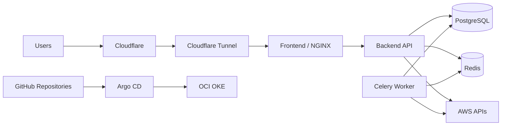

# CloudOps Insight Infrastructure

Terraform infrastructure for the CloudOps Insight GitOps-based Kubernetes platform.

CloudOps Insight currently runs on Oracle Cloud Infrastructure using OCI Kubernetes Engine (OKE).
The original AWS EKS hosting platform has been retired after the successful production migration.

## Current Production Architecture



## Production Platform

Production is hosted in OCI Frankfurt using:

- OCI Kubernetes Engine (OKE)
- OKE Basic cluster
- ARM64 VM.Standard.A1.Flex worker
- 1 worker node
- 2 OCPUs
- 12 GB memory
- OCI Virtual Cloud Network
- OCI Block Volume CSI storage
- OCI Object Storage remote Terraform state

The platform is intentionally designed as a low-cost portfolio and demonstration environment.

## Kubernetes Workloads

The OKE cluster runs:

- React/Vite frontend
- backend API
- Celery worker
- Celery Beat
- PostgreSQL
- Redis
- Argo CD
- Cloudflare Tunnel connector

Application images are published as multi-platform containers supporting both linux/amd64 and linux/arm64.

## Public Access

Production traffic is exposed through Cloudflare Tunnel.

No OCI public Load Balancer is required for the application.

Production hostname:

`cloudinsight.ridhampansara.dev`

Traffic path:

```text
Internet
    |
Cloudflare
    |
Cloudflare Tunnel
    |
OCI OKE
    |
Frontend / NGINX
    |
Backend API
```

## GitOps

Application deployment is managed through the cloudops-gitops repository.

```text
Application repository
        |
        v
GitHub Container Registry
        |
        v
GitOps repository
        |
        v
Argo CD
        |
        v
OCI OKE
```

Terraform manages cloud infrastructure.
Argo CD manages Kubernetes application desired state.

## AWS Monitoring Integration

AWS is no longer used to host CloudOps Insight.

AWS remains a monitored cloud provider so CloudOps Insight can continue demonstrating multi-cloud resource discovery, metrics, cost analysis, health monitoring and FinOps functionality.

The OCI-hosted application accesses AWS through a restricted bootstrap identity that assumes:

`CloudOpsReadOnlyRole`

These monitoring identities are intentionally outside the retired AWS EKS Terraform state.

## Terraform Environments

### environments/oci-dev

Active OCI infrastructure environment.

It manages the OCI project compartment, networking and OKE platform.

Reusable OCI modules:

```text
modules/
|-- oci-network/
`-- oke/
```

### environments/dev

Retired AWS EKS environment.

This directory is retained only as a tombstone documenting the former AWS platform and historical remote-state location.

It contains no active Terraform resources, modules, providers, variables or outputs.

It must not be used to recreate the retired AWS hosting platform.

## Terraform State

### OCI

Active OCI Terraform state is stored remotely in OCI Object Storage.

The backend storage is provisioned separately from the Terraform state it stores.

### Retired AWS

The historical AWS development backend configuration is retained for documentation and state-history purposes.

The retired AWS Terraform state contains no managed runtime resources.

## Pull Request CI

GitHub Actions performs credential-free Terraform validation:

1. terraform fmt -check -recursive
2. validate the retired AWS tombstone
3. validate the OCI Terraform configuration with the backend disabled
4. run Trivy IaC security scanning
5. verify that the retired AWS environment cannot recreate infrastructure
6. execute the credential-free AWS tombstone no-op plan

Required branch-protection checks:

- Terraform validate
- Terraform plan

The Terraform plan status is currently a safety gate and does not run a cloud-connected OCI execution plan.

## OCI Infrastructure Changes

Cloud-connected OCI Terraform plan and apply operations are currently performed manually from an authenticated operator workstation using the OCI CLI API-key profile.

GitHub Actions does not currently receive OCI cloud credentials.

Non-interactive OCI CI authentication can be introduced separately in a future hardening stage.

## Security

- no OCI credentials committed to Git
- OCI credentials remain in the local OCI CLI configuration
- Terraform state stored remotely
- main branch protection enabled
- required Terraform validation checks
- Trivy IaC scanning
- GitOps-based Kubernetes deployment
- restricted AWS read-only monitoring integration
- no AWS application hosting infrastructure
- no OCI application Load Balancer
- Cloudflare Tunnel for production ingress

## Related Repositories

### cloudops-insight

Application source, frontend/backend tests, container builds and multi-platform GHCR publishing.

### cloudops-gitops

Helm configuration, Argo CD applications and Kubernetes desired state.

### cloudops-infrastructure

Terraform cloud infrastructure and infrastructure CI validation.

## Migration Status

AWS EKS hosting has been fully retired.

The production architecture is now:

**OCI OKE + GitOps + Argo CD + Cloudflare Tunnel**

AWS remains only as a monitored cloud provider for CloudOps Insight.
