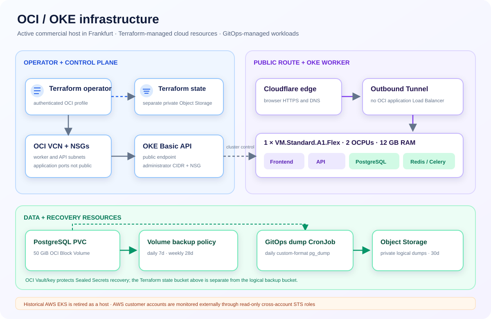

# CloudOps Insight · Infrastructure

[](https://github.com/ridhampansara27/cloudops-infrastructure/blob/main/.github/workflows/terraform-pr.yml)


**Terraform for the production OCI foundation behind [CloudOps Insight](https://github.com/ridhampansara27/cloudops-insight).** This repository defines the VCN, network security boundaries, OKE cluster and worker, Block Volume protection, private backup storage, and Sealed Secrets recovery resources. Kubernetes workloads are delivered separately through [cloudops-gitops](https://github.com/ridhampansara27/cloudops-gitops) and Argo CD.

> [!IMPORTANT]
> **Current host: OCI Frankfurt / OKE.** The `environments/oci-dev` name is historical; it is the active commercial host. AWS EKS infrastructure is retired and preserved only for state history and architectural reference. The certified infrastructure snapshot was `54ddda1611a036a60250fa8e49ab3f1bd36b468d` on 29 September 2026. Check live OCI resources and remote Terraform state before any plan or recovery operation.

**Explore:** [Architecture](#architecture) · [Repository map](#repository-map) · [Versions](#versions-and-sizing-represented-by-code) · [Terraform workflow](#terraform-state-and-change-process) · [Recovery](#backups-and-disaster-recovery)

## Architecture



The browser path is Cloudflare → outbound Tunnel → frontend on OKE. The public Kubernetes API is an **operator control-plane path** restricted by NSG and administrator CIDR; it is not the application ingress. Terraform uses a separately provisioned private Object Storage bucket for state. The PostgreSQL volume policy and the GitOps logical-dump job protect different failure modes. [Detailed topology and trust boundaries](docs/architecture.md) describes the current OCI and historical AWS split.

| Repository | Responsibility | Change boundary |
|---|---|---|
| [cloudops-insight](https://github.com/ridhampansara27/cloudops-insight) | Product code, migrations, tests, SHA-tagged images | Application CI and image publication |
| [cloudops-gitops](https://github.com/ridhampansara27/cloudops-gitops) | Helm, OCI values, Argo CD, Cloudflare Tunnel and logical dump CronJob | Reviewed values change and controlled sync |
| **This repository** | OCI VCN, OKE, state, volume policy, backup bucket and recovery vault | Authenticated Terraform plan and apply |

The API endpoint is public but restricted by its NSG and configured administrator CIDR. The worker subnet permits public IPs for low-cost outbound access, with no Internet-facing application ports in its NSG. Application traffic enters through Cloudflare Tunnel, not an OCI Load Balancer. This single-worker, in-cluster PostgreSQL design is **not highly available**.

### Design trade-offs

| Choice | Benefit | Limit to plan around |
|---|---|---|
| One ARM A1 worker and OKE Basic | Small production footprint and simple operations | A worker or in-cluster database outage interrupts the service |
| Outbound Cloudflare Tunnel | HTTPS public access without an OCI application Load Balancer | Tunnel and edge availability are part of the application path |
| Public OKE API restricted by CIDR/NSG | Operator access without a bastion | Administrator CIDR and credentials require careful maintenance |
| PostgreSQL on OCI Block Volume | Persistent storage with volume backup policy | Restore validation and logical backup monitoring remain essential |

## Repository map

| Path | Status and ownership |
|---|---|
| `environments/oci-dev/` | **Active** OCI compartment, VCN, OKE, backups, bucket/lifecycle policy, Sealed Secrets recovery vault, remote state |
| `modules/oci-network/`, `modules/oke/` | Reusable OCI VCN/security and OKE components |
| `bootstrap/` | Historical AWS state and GitHub OIDC bootstrap configuration; inspect before any use |
| `environments/dev/` | Retired EKS environment tombstone, retained for state-history safety |
| `modules/eks/`, `modules/network/`, `modules/rds/`, `modules/iam/`, `modules/secrets/` | Historical AWS architecture modules, not referenced by active OCI environment |
| `docs/history/` | Preserved AWS cost, services, networking, and demo notes |

The label `oci-dev` is historical: it is the currently used OCI commercial host. See [architecture](docs/architecture.md) for current and historical boundaries.

## Versions and sizing represented by code

| Component | Configured value | Source |
|---|---|---|
| Terraform CLI | `>= 1.11.0` required; CI uses `1.15.8` | OCI `versions.tf`, PR workflow |
| Oracle OCI provider | `8.29.0` locked | OCI `.terraform.lock.hcl` |
| OKE Kubernetes | `v1.35.2` **variable default**, not live verification | OCI `variables.tf` |
| Cluster and networking | Basic tier, Flannel Overlay | `modules/oke/main.tf` |
| Worker | 1 × `VM.Standard.A1.Flex`, 2 OCPUs, 12 GB RAM, 50 GB boot volume | OCI `main.tf` |
| AWS bootstrap providers | `6.60.0` and `6.62.0` locks | Two historical bootstrap lockfiles |

Kubernetes and node-image versions must be verified against the running OCI cluster. PostgreSQL `17-alpine` and application image tags live in GitOps rather than Terraform.

## Terraform state and change process

OCI state is stored in a separately provisioned private Object Storage bucket; the state bucket is **not** managed by the state it holds. Local `terraform.tfvars` and OCI CLI API-key profile are ignored by Git. Never commit state, plans, API keys, bucket credentials, or a real administrator CIDR.

Pull-request CI runs formatting, backend-disabled OCI validation, Trivy IaC scanning, and a credential-free **retired AWS tombstone no-op plan**. Its required check named “Terraform plan” is **not** an OCI cloud-connected plan. An authenticated operator currently reviews and applies OCI changes manually.

Read [the OCI change runbook](docs/runbooks/oci-change.md) before planning or applying. The following commands are **local static validation only**:

```powershell
Set-Location environments/oci-dev
terraform fmt -check -recursive
terraform init -backend=false
terraform validate
```

`terraform init -backend=false` does not check remote state or current OCI drift. A cloud-connected plan requires the authorized OCI profile, state access, and an operator review.

## Backups and disaster recovery

Terraform assigns the PostgreSQL Block Volume daily incremental backups (7-day retention) and weekly incremental backups (28-day retention). It also manages a private logical-backup bucket with a 30-day object lifecycle, lifecycle service IAM, and protected OCI Vault/key resources for Sealed Secrets recovery. The GitOps CronJob produces and uploads the **logical** dumps; Terraform does not execute that Job.

Use [the backup and state recovery runbook](docs/runbooks/oci-recovery.md). The certified launch included an isolated database restore drill, but each subsequent backup still needs independent monitoring and periodic restore testing.

## Security and contribution

The active VCN uses network security groups to restrict the public Kubernetes API to an explicit administrator CIDR. Cloudflare Tunnel supplies public application access without an OCI application Load Balancer. OCI Kubernetes uses Flannel Overlay; do not claim Kubernetes NetworkPolicy enforcement until the networking implementation changes.

See [SECURITY.md](SECURITY.md), [CONTRIBUTING.md](CONTRIBUTING.md), and [CHANGELOG.md](CHANGELOG.md). No documentation change in this repository requires or performs a Terraform apply.

---

© 2026 Ridham Pansara. All rights reserved.
