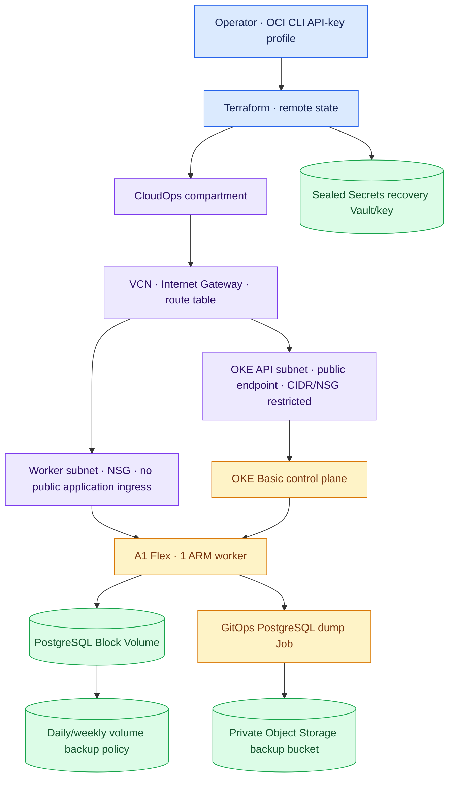
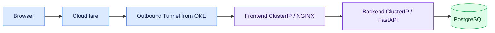

# OCI infrastructure architecture

## Active control and data planes

The separately bootstrapped Object Storage Terraform backend is not represented by the backup bucket above. The two buckets serve different recovery purposes. Terraform manages cloud resources; [GitOps](https://github.com/ridhampansara27/cloudops-gitops) manages Kubernetes workloads and the logical dump CronJob.

## Public application route

The public Kubernetes API endpoint is an **operator control-plane path**, separate from the browser route. OCI NSG ingress restricts access to the configured administrator CIDR. The application uses no OCI public Load Balancer or public NodePort.

## Former AWS EKS host

`environments/dev/` is an inert state-history tombstone. EKS, ALB, VPC, IAM, RDS, and secret modules remain as historical architecture material. They are not called from active `environments/oci-dev/main.tf`. AWS customer accounts are still monitored by the OCI-hosted application through STS cross-account roles; this does not recreate EKS hosting. The preserved EKS cost and demo documents live in [history](history/).

## Recovery dependencies

- Remote OCI Terraform state and its bucket must be available to reconcile managed infrastructure.
- PostgreSQL has distinct Block Volume and logical Object Storage backup layers; select a verified recovery point before any cutover.
- Sealed Secrets recovery requires protected controller key material; a new controller without the original key cannot decrypt previously sealed values.
- A single worker means maintenance or worker loss can interrupt service. The design deliberately favors low cost over high availability.
